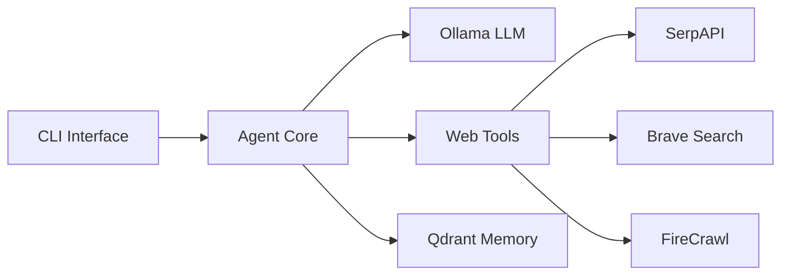

<div align="center">

# 🧠 Ollama CLI Agent

**A privacy-first, terminal-based AI assistant with real-time web access, persistent memory, and local LLM intelligence**

[](https://www.python.org/downloads/)
[](https://ollama.ai/)
[](LICENSE)
[](https://github.com/psf/black)

[Features](#-features) • [Installation](#-installation) • [Quick Start](#-quick-start) • [Documentation](#-documentation) • [Contributing](#-contributing)

</div>

---

## ✨ Features

<table>
<tr>
<td>

### 🔒 Privacy First
- **100% Local LLM** via Ollama
- **No data leaves your machine**
- **Offline-capable** after ingestion

</td>
<td>

### 🌐 Web Intelligence
- **Live Search** (SerpAPI, Brave)
- **Smart Scraping** (FireCrawl)
- **Auto-ingest** web content

</td>
</tr>
<tr>
<td>

### 🧠 Persistent Memory
- **Vector embeddings** with Qdrant
- **Semantic search** across sessions
- **Context-aware** responses

</td>
<td>

### ⚡ Developer Friendly
- **Terminal-first** interface
- **Modular architecture**
- **Easy to extend** with plugins

</td>
</tr>
</table>

## 🚀 Installation

### Prerequisites
- Python 3.11+
- [Ollama](https://ollama.ai/) installed
- [Micromamba](https://mamba.readthedocs.io/en/latest/installation.html) (recommended) or conda

### Quick Setup

```bash
# 1. Clone the repository
git clone https://github.com/b0onzy/ollama-cli-agent.git
cd ollama-cli-agent

# 2. Create and activate environment
micromamba create -n ollama-cli-agent python=3.11 -y
micromamba activate ollama-cli-agent

# 3. Install dependencies
pip install -r requirements.txt

# 4. Setup configuration (optional for web tools)
cp .env.sample .env
# Edit .env with your API keys

# 5. Pull required Ollama models
ollama pull mistral:7b  # Main LLM
ollama pull all-minilm  # Embeddings
```

## ⚡ Quick Start

### Launch the Assistant

```bash
# Basic usage
python assistant.py

# With custom model
python assistant.py --model llama2:7b

# Debug mode
python assistant.py --debug
```

### Available Commands

| Command | Description | Example |
|---------|-------------|----------|
| `ask` | Ask questions to the AI | `ask What is machine learning?` |
| `search` | Search the web | `search latest AI news` |
| `fetch` | Fetch and display web content | `fetch https://example.com` |
| `ingest` | Add content to memory | `ingest Python is a programming language` |
| `stats` | View memory statistics | `stats` |
| `help` | Show all commands | `help` |
| `exit` | Exit the assistant | `exit` |

### Example Session

```bash
You> search Python web frameworks
🔍 Searching the web...
[Results displayed]

You> fetch https://flask.palletsprojects.com/
🌐 Fetching content...
[Content displayed]

You> ingest
💾 Content ingested to memory!

You> ask What are the main features of Flask?
🤔 Thinking...
Flask is a lightweight web framework with these main features:
- Minimal and flexible
- Built-in development server
- RESTful request dispatching
...
```

## 📁 Project Structure

```
ollama-cli-agent/
├── 📄 assistant.py          # Main entry point
├── 📁 src/
│   ├── agent.py            # Core agent logic
│   ├── assistant.py        # CLI command handlers
│   └── qdrant_store.py     # Vector database interface
├── 📁 web_tools/
│   ├── serpapi_tool.py     # Google search integration
│   ├── brave_tool.py       # Brave search integration
│   └── firecrawl_tool.py   # Web scraping tool
├── 📁 utils/
│   └── logging.py          # Logging configuration
├── 📁 tests/               # Test suite
├── 📄 requirements.txt     # Python dependencies
├── 📄 .env.sample         # Environment template
├── 📄 plan.md             # Development plan
└── 📄 task.md             # Current tasks
```

## 🏗️ Architecture



## 🔧 Configuration

### Environment Variables

Create a `.env` file from the template:

```bash
# Web Search APIs (optional)
SERPAPI_API_KEY=your_serpapi_key
BRAVE_API_KEY=your_brave_key
FIRECRAWL_API_KEY=your_firecrawl_key

# Qdrant Configuration (optional)
QDRANT_URL=http://localhost:6333
QDRANT_COLLECTION=ollama_cli_agent
```

### Supported Models

Any Ollama-compatible model can be used:

```bash
# List available models
ollama list

# Popular alternatives
ollama pull llama2:13b      # Larger, more capable
ollama pull codellama:7b    # Better for coding
ollama pull phi:2.7b        # Smaller, faster
```

## 🧪 Testing

```bash
# Run all tests
python -m unittest discover tests -v

# Run with coverage
pip install coverage
coverage run -m unittest discover tests
coverage report --show-missing
```

## 🐛 Troubleshooting

<details>
<summary><b>Ollama Connection Issues</b></summary>

- Ensure Ollama is running: `ollama serve`
- Check if models are installed: `ollama list`
- Verify connection: `curl http://localhost:11434/api/tags`

</details>

<details>
<summary><b>Model Not Found</b></summary>

```bash
# Pull required models
ollama pull mistral:7b
ollama pull all-minilm
```

</details>

<details>
<summary><b>Web Search Not Working</b></summary>

- Verify API keys in `.env` file
- Check API credit/limits
- Test with `--debug` flag for detailed logs

</details>

<details>
<summary><b>Memory/Qdrant Issues</b></summary>

- Default: In-memory storage (no setup needed)
- For persistence: `docker run -p 6333:6333 qdrant/qdrant`

</details>

## 🗺️ Roadmap

### Near Term
- [x] Core CLI interface
- [x] Web search integration
- [x] Memory persistence
- [ ] Streaming responses
- [ ] Command auto-completion

### Future Plans
- [ ] Plugin system for custom tools
- [ ] Export conversation history
- [ ] Rich terminal UI with colors
- [ ] Additional web sources (Wikipedia, arXiv)
- [ ] Optional web UI via Chainlit

## 🤝 Contributing

Contributions are welcome! Please feel free to submit a Pull Request.

1. Fork the repository
2. Create your feature branch (`git checkout -b feature/AmazingFeature`)
3. Commit your changes (`git commit -m 'Add some AmazingFeature'`)
4. Push to the branch (`git push origin feature/AmazingFeature`)
5. Open a Pull Request

### Development Guidelines

- Follow [PEP 8](https://www.python.org/dev/peps/pep-0008/) style guide
- Add tests for new features
- Update documentation as needed
- Keep commits atomic and descriptive

## 📄 License

This project is licensed under the MIT License - see the [LICENSE](LICENSE) file for details.

## 🙏 Acknowledgments

- [Ollama](https://ollama.ai/) for local LLM inference
- [Qdrant](https://qdrant.tech/) for vector storage
- [LangChain](https://langchain.com/) for LLM tooling
- All contributors and supporters

---

<div align="center">

**Built with ❤️ for privacy-conscious developers**

[Report Bug](https://github.com/b0onzy/ollama-cli-agent/issues) • [Request Feature](https://github.com/b0onzy/ollama-cli-agent/issues)

</div>

